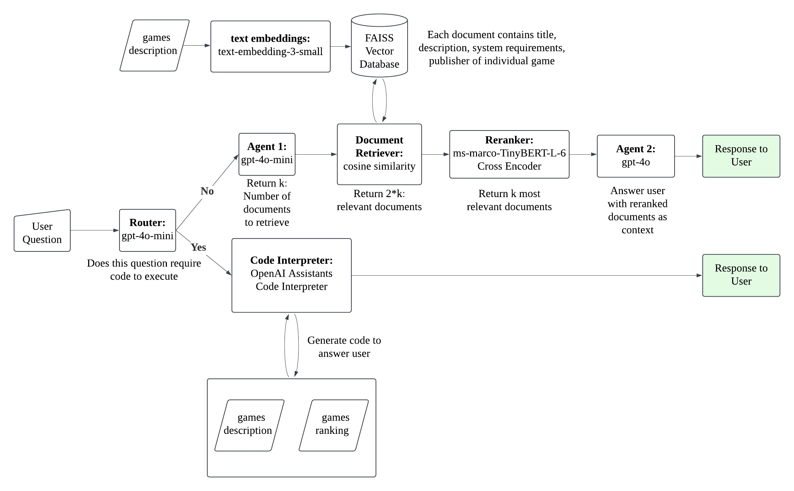

# game assistant
This repository contains a Dockerized Flask API and Streamlit app designed for a RAG based Game Assistant that addresses user queries about a game descriptions dataset. The system leverages a multi-agent pipeline for intelligent search and response, incorporating vector embeddings stored in FAISS for efficient metadata retrieval. The pipeline supports local and cloud deployment, with an option to extend functionality using AWS services like ECR and ECS.

# API Endpoint Usage
- Base URL: `<your_ip>:5000/answer_query`
- Request Format: Send a JSON payload with the following structure:
```json
{
   "query":"your query",
   "session_id":"your session id"
}
```
# Demo Solution (Hosted on AWS ECS) - INACTIVE
- API Endpoint: http://44.222.108.94:5000/answer_query
- Streamlit App: http://44.200.169.240:8501/

# Set Up
## Installation
1. Clone the repo
```bash
git clone git@github.com:hoofangyu/razer-assessment.git
```
2. Move into razer-assessment directory
```bash
cd razer-assessment
```
3. Set Up the API Configuration
- Create a `config.py` file in the `src/utils` directory to store your OpenAI API key. Add the following line to the file:
```bash
OPENAI_API_KEY = "<your openai api key>"
```
4. Install required packages
```bash
pip install -r requirements.txt
```
5. (Optional) Create new files for VectorDB
- Pre-existing files already in repository for the dataset from kaggle, run this only if you have a new `games_description.csv` file
```bash
python -m src.scripts.generate_embeddings --descriptions-path /path/to/games_description.csv
```
6. Build the Docker Image
```bash
docker build -t game-assistant .
```
## Local Deployment
1. Run Docker Image
```bash
docker run -d -p 5000:5000 game assistant  
```
3. Access the Flask APi
- The Flask API is now running and can be accessed at: http://localhost:5000

## Cloud Deployment on AWS
1. Ensure that AWS CLI is installed and configured
```bash
aws configure
```
2. Push the Docker Image to Amazon ECR
- Authenticate Docker to ECR
```bash
aws ecr get-login-password --region <AWS_REGION> | docker login --username AWS --password-stdin <AWS_ACCOUNT_ID>.dkr.ecr.<AWS_REGION>.amazonaws.com
```
- Create an ECR Repository
```bash
aws ecr create-repository --repository-name game-assistant
```
- Tag Docker Image
```bash
docker tag game-assistant:latest <AWS_ACCOUNT_ID>.dkr.ecr.<AWS_REGION>.amazonaws.com/game-assistant:latest
```
- Push the Image to ECR
```bash
docker push <AWS_ACCOUNT_ID>.dkr.ecr.<AWS_REGION>.amazonaws.com/game-assistant:latest
```
3. Deploy the Docker Image on Amazon ECS with AWS Console
   1. Create an ECS Cluster with Fargate launch type
   2. Create Task Definition with Fargate launch type and container with:
       - Image: `<AWS_ACCOUNT_ID>.dkr.ecr.<AWS_REGION>.amazonaws.com/game-assistant:latest`
       - Port Mappings: `5000`
   3. Click on `Create Service` under `Deploy` for the Task Definition created
   4. Access the API with the `Public IP` for the Task

## Running the Streamlit App to Access the API Endpoint
1. Modifiy `ip` variable in `src/streamlit_app.py`
- default: `"localhost"` for local deployment
- `"<your ecs ip address>"` for AWS deployment
2. Run the Streamlit App
```bash
streamlit run src/streamlit_app.py
```
3. Access the Streamlit App
- The Streamlit app is now running and can be accessed at: http://localhost:8501

<br>

# Pipeline Overview



---

## **Session Management: Chat Memory**

- Store the output of **Agent 2** in a `ChatMemory` data structure.
- Link the chat history to the user's `session_id` to maintain context across queries within the same session.

---

## **Payload Requirements**

Each API payload must include:

1. **`query`**: The user’s query.  
2. **`session_id`**: A unique identifier for the user’s session, generated client-side (e.g., in the Streamlit app) and passed to the endpoint.

---


